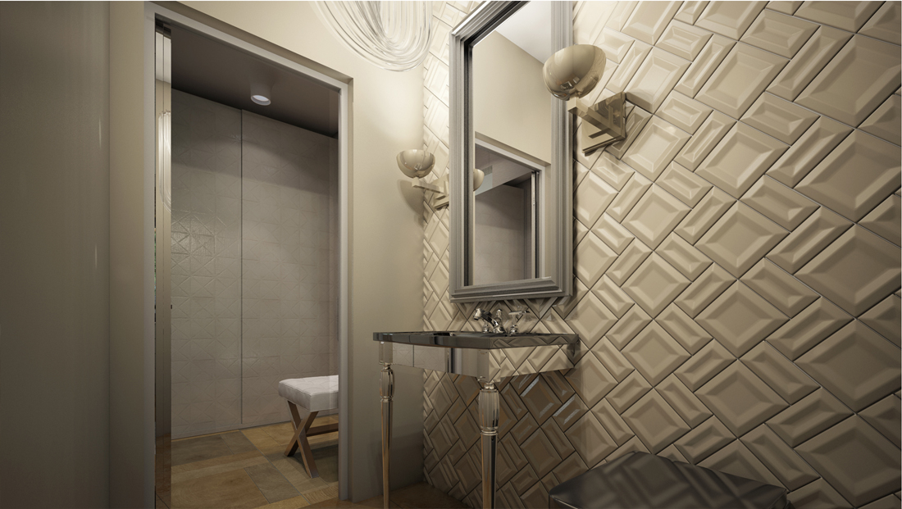
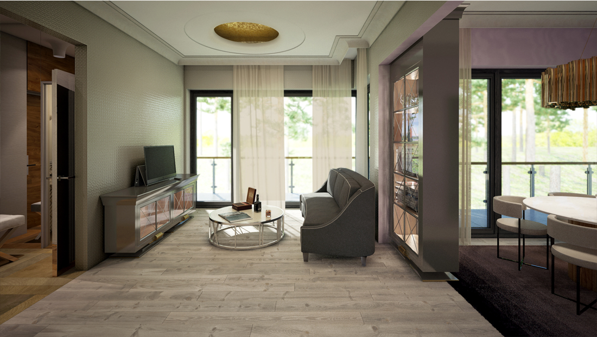
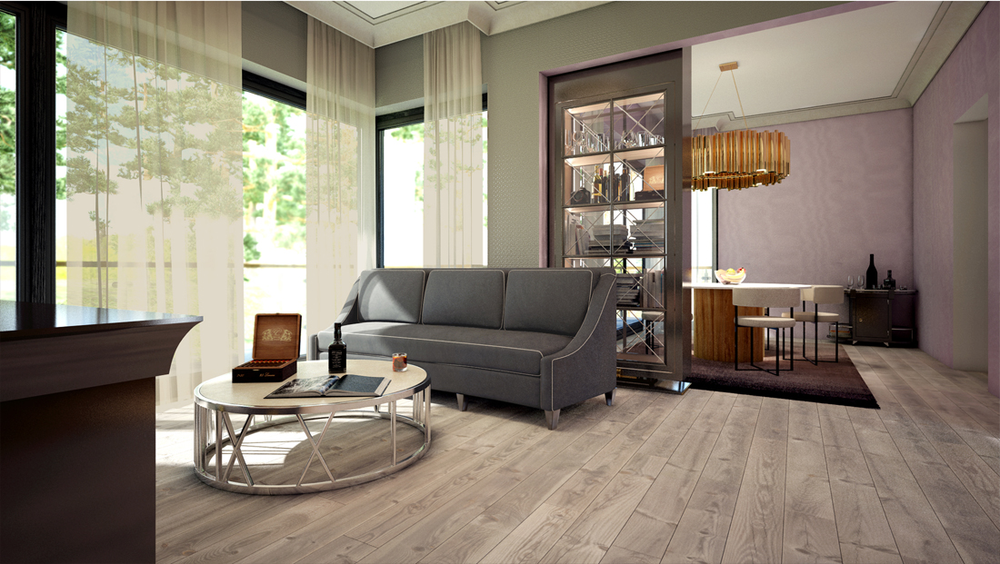
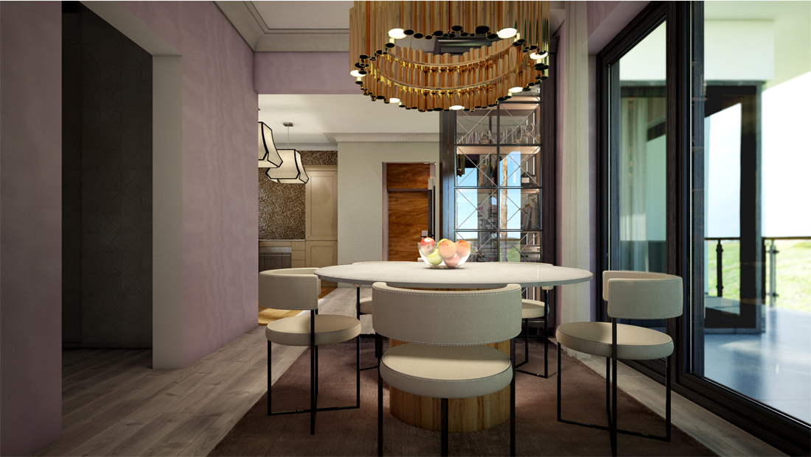

+++
weight = 3
date = "2014-07-11T10:54:24+02:00"
draft = false
title = "Ceriņu, Interior project"
desc = "Interior project for an apartment"
location = "Jūrmala, Latvia"
architect = "Architect"
designer = "Elizabete Ivanova"
cooparation = "n/a"
tags    =  "Exterior" 
slug = "cerinu"
thumbnail = "images/projects/cerinu/700/1.jpg"
+++

