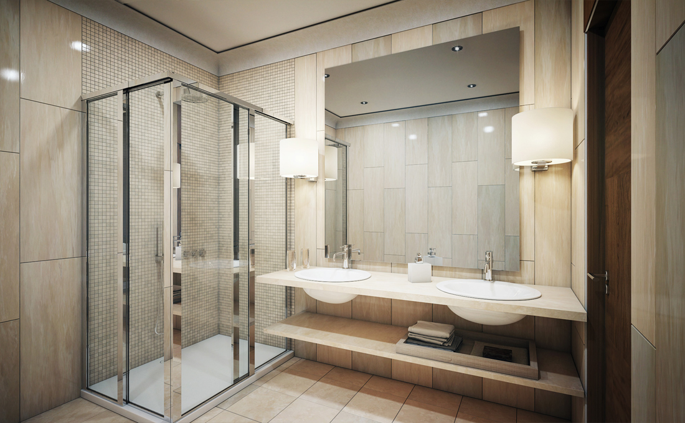
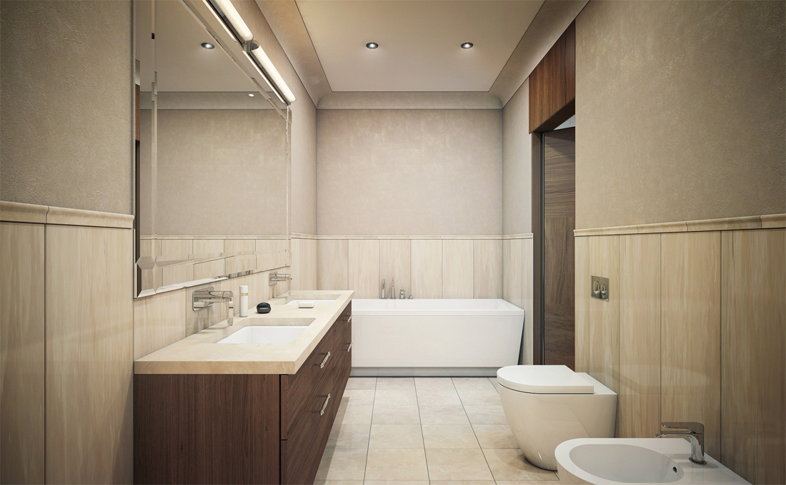
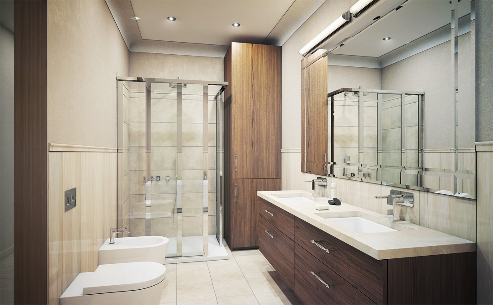
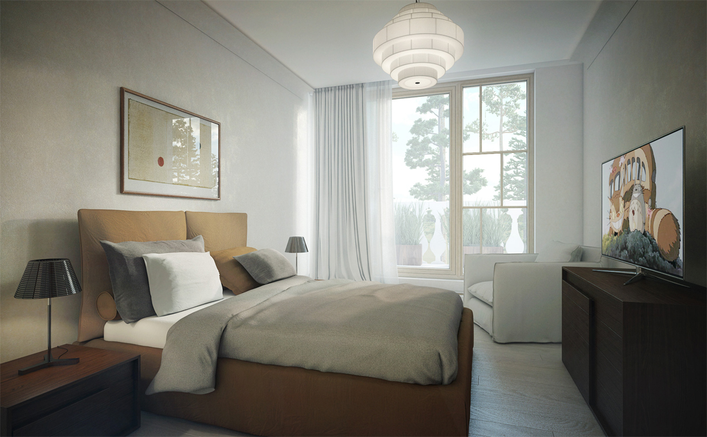
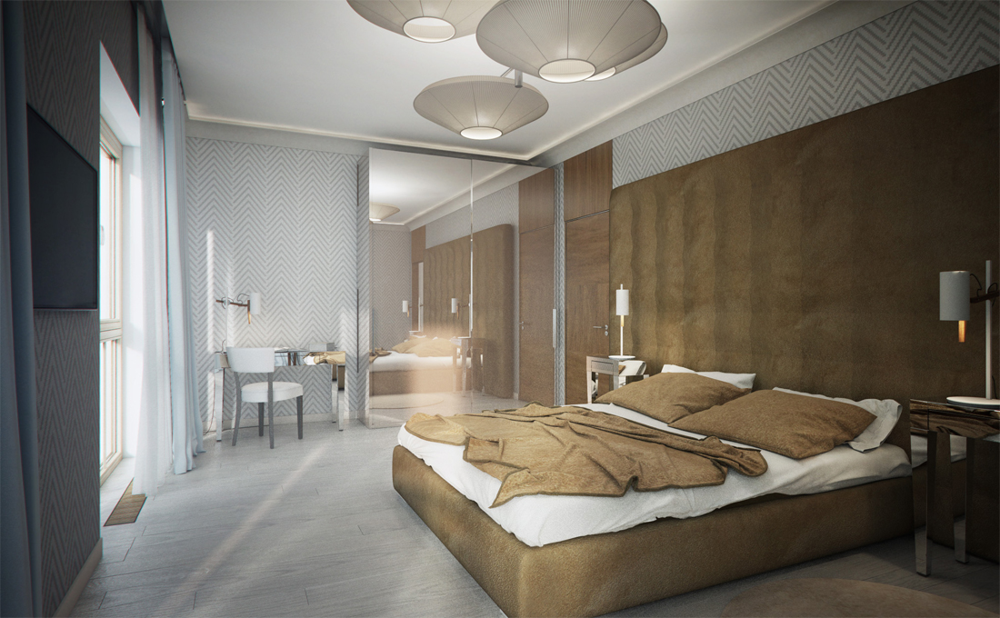
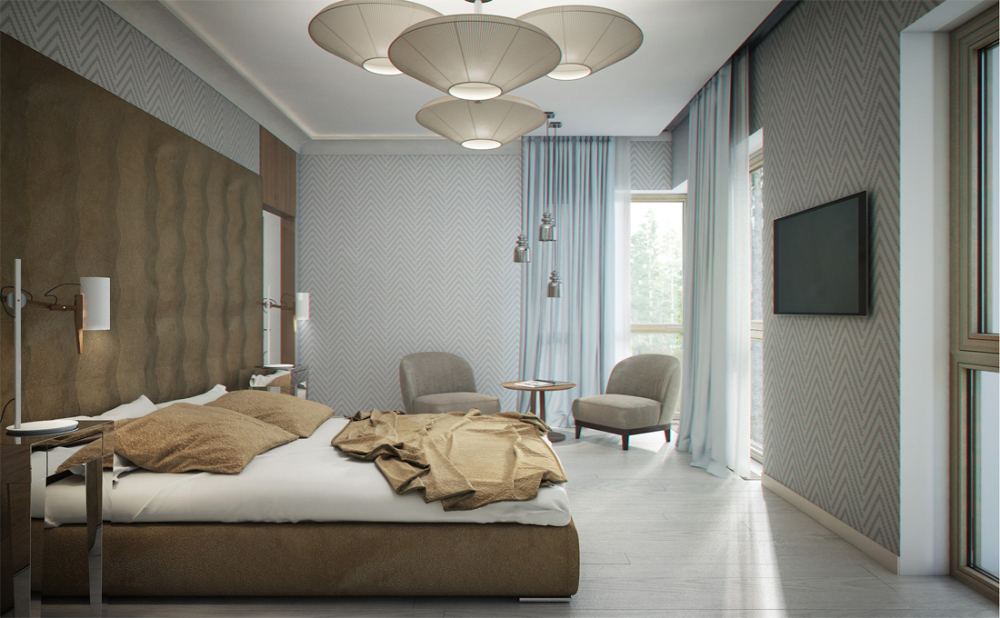
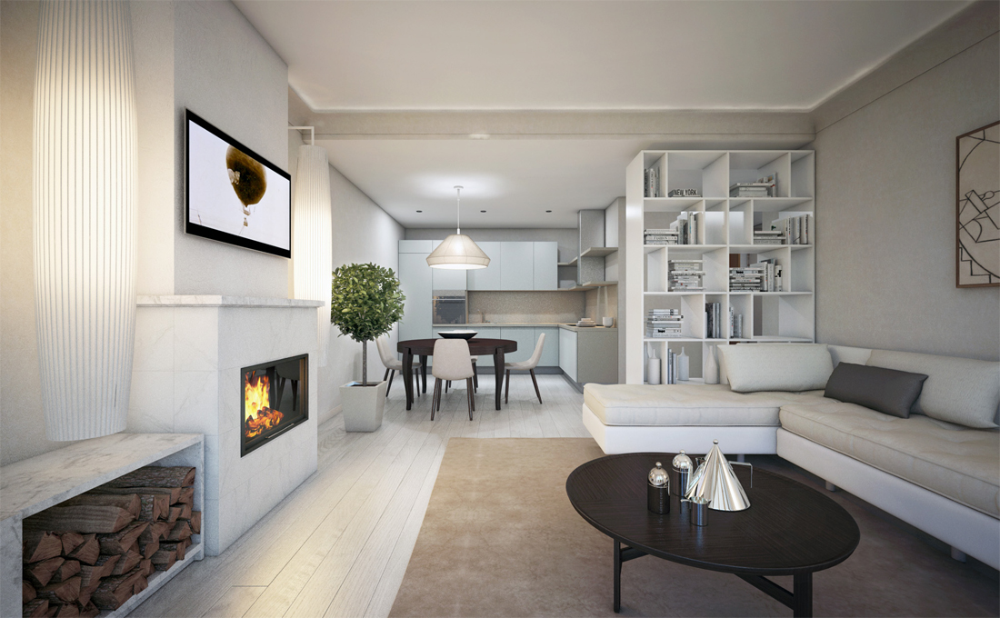
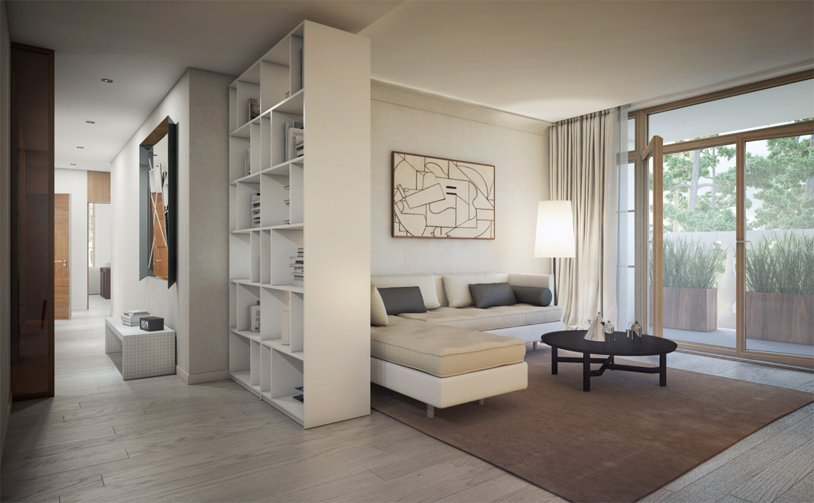

+++
weight = 4
date = "2014-07-11T10:54:24+02:00"
draft = false
title = "Villa Dietrich"
desc = "Interior project for an apartment"
location = "Jūrmala, Latvia"
architect = "Architect"
designer = "Elizabete Ivanova"
cooparation = "Matīss Mailītis"
tags    = [ "Interior" ]
slug = "dietrich"
thumbnail = "images/projects/dietrich/700/1.jpg"
+++

