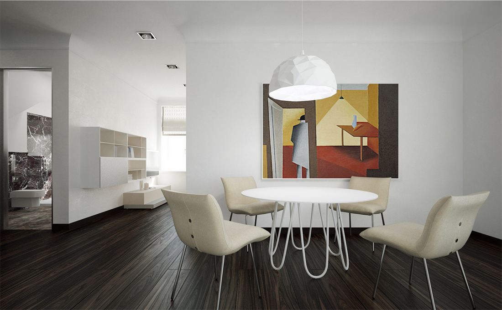

+++
weight = 8
date = "2014-07-11T10:54:24+02:00"
draft = false
title = "Elizabetes iela"
desc = "Interior project that consist 8 apartments and more than 100 renders"
location = "Rīga, Latvia"
architect = "Architect"
designer = "Elizabete Ivanova"
cooparation = "Matīss Mailītis"
tags    = [ "Interior" ]
slug = "elizabetes"
thumbnail = "images/projects/elizabetes/700/1.jpg"
+++

