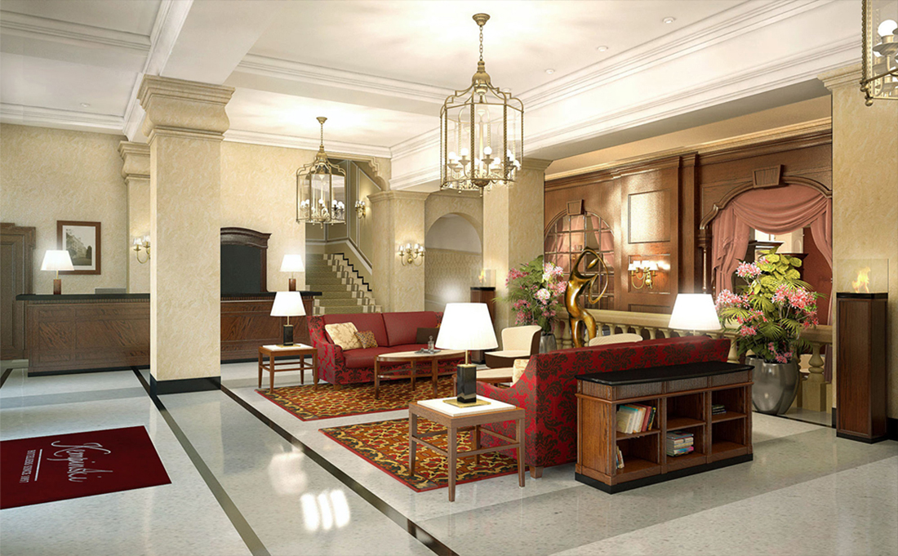
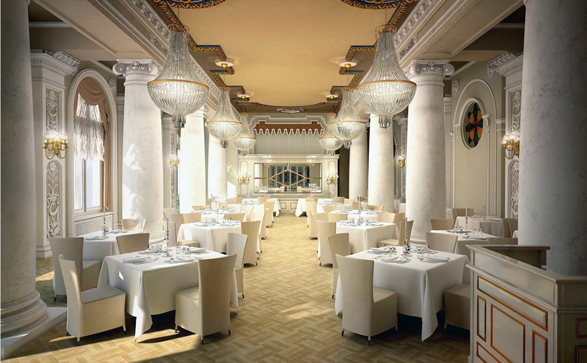
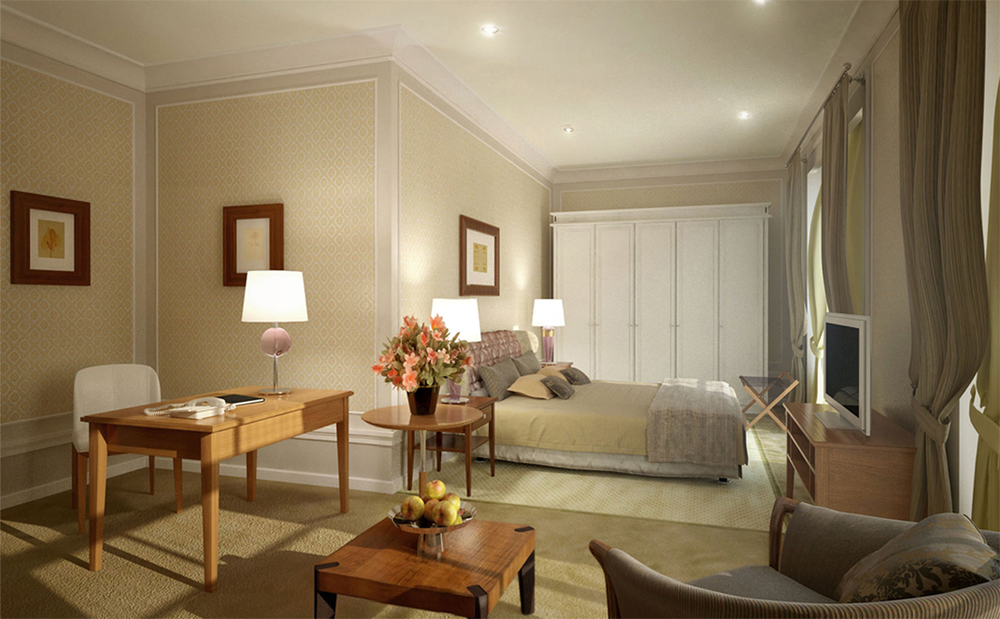

+++
weight = 10
date = "2014-07-11T10:54:24+02:00"
draft = false
title = "Ķemeri"
desc = "Conceptual project for Ķemeri sanatorium that consists of more than 50 renders"
location = "kemeri"
architect = "Architect"
designer = "Designer"
cooparation = "Matīss Mailītis"
tags    = "Interior"
slug = "kemeri"
thumbnail = "images/projects/kemeri/350/1.jpg"
+++

