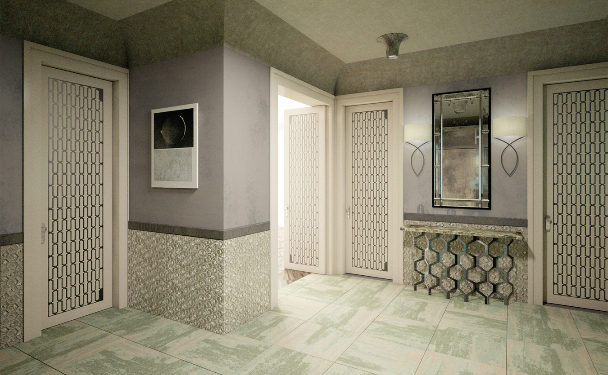
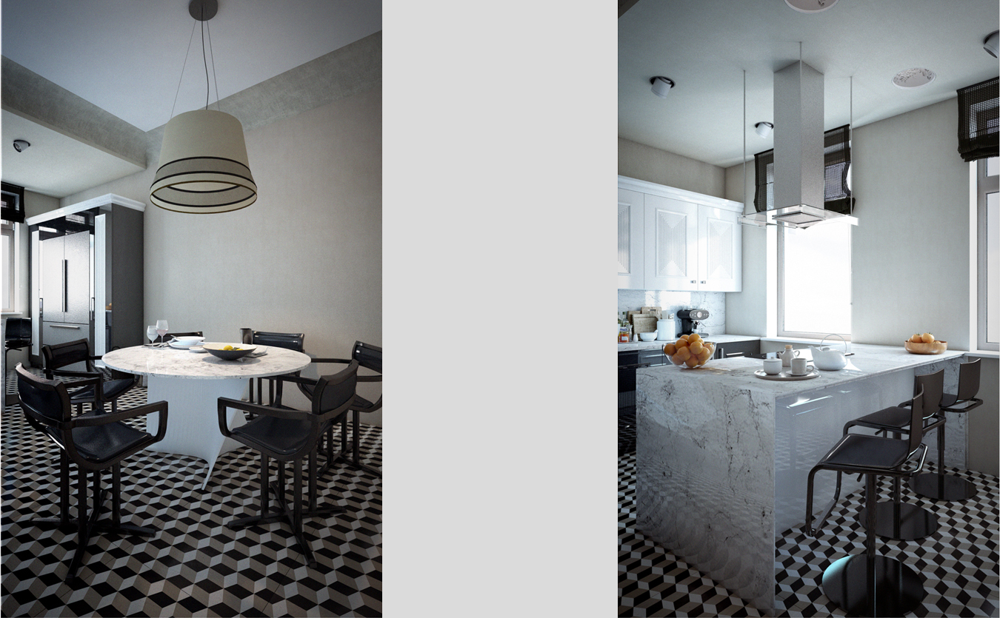
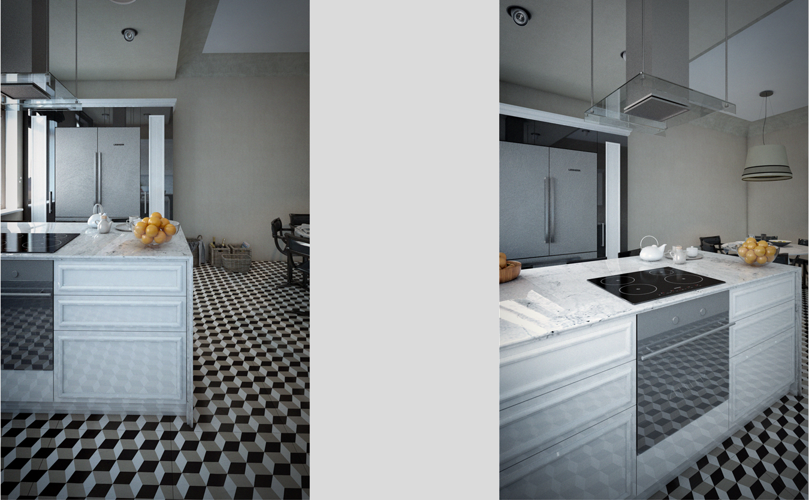
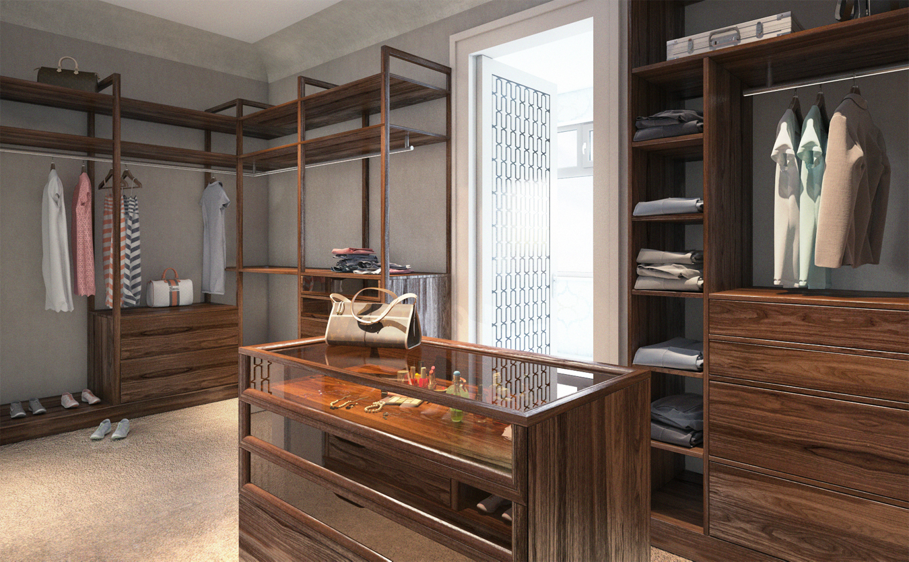
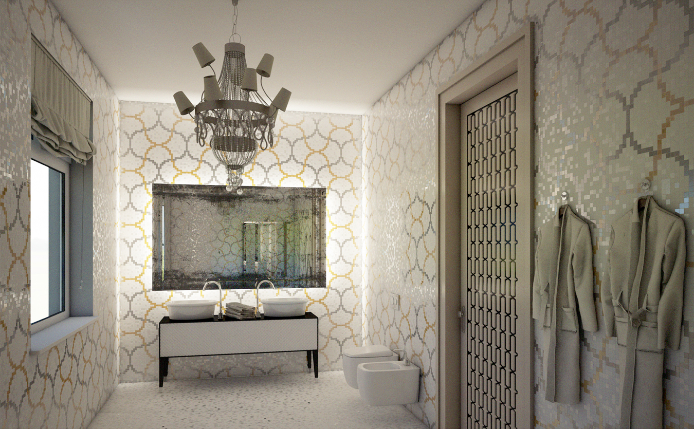

+++
weight = 1
date = "2014-07-11T10:54:24+02:00"
draft = false
title = "Moscow"
desc = "Designs and concept of an apartment"
location = "Moscow, Russia"
architect = "n/a"
designer = "Elizabete Ivanova"
cooparation = "n/a"
tags    = "Interior"
slug = "maskava"
thumbnail = "images/projects/maskava/350/1.jpg"
+++

