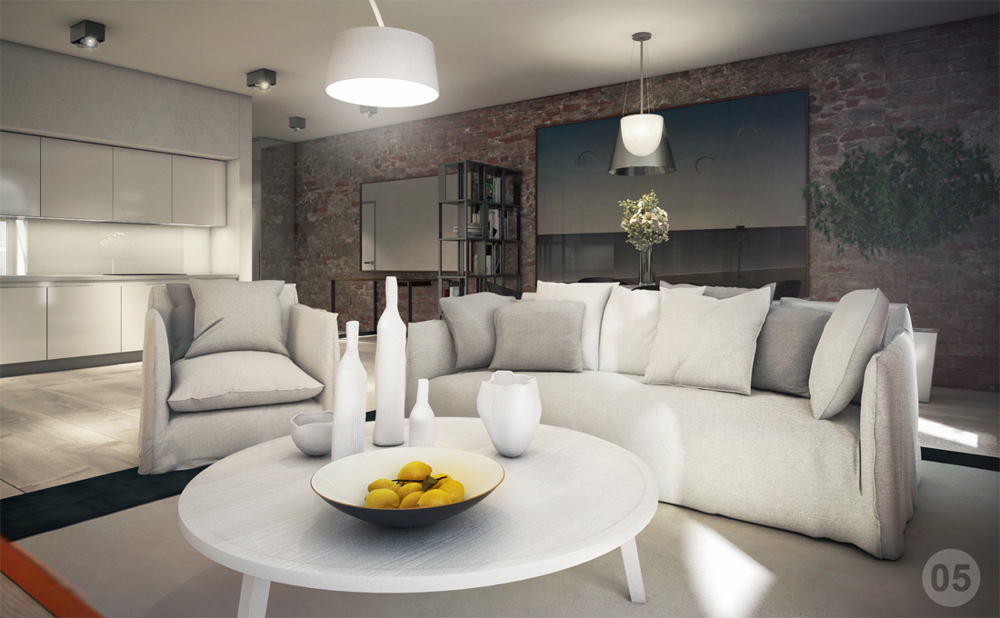
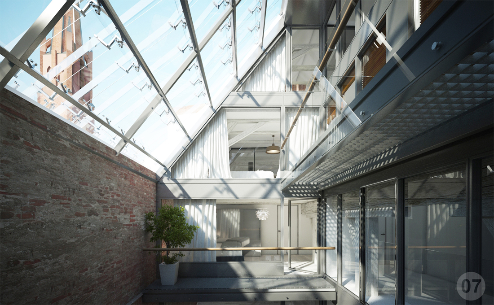
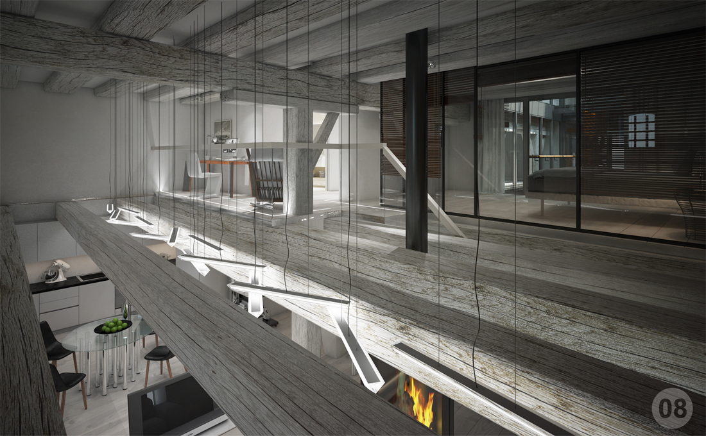
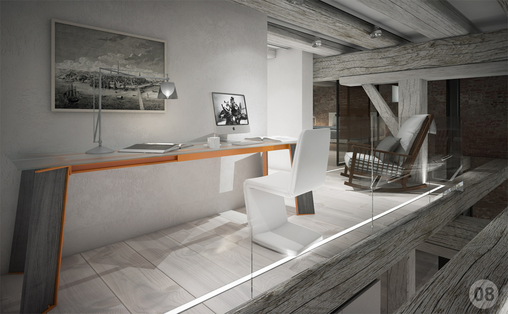
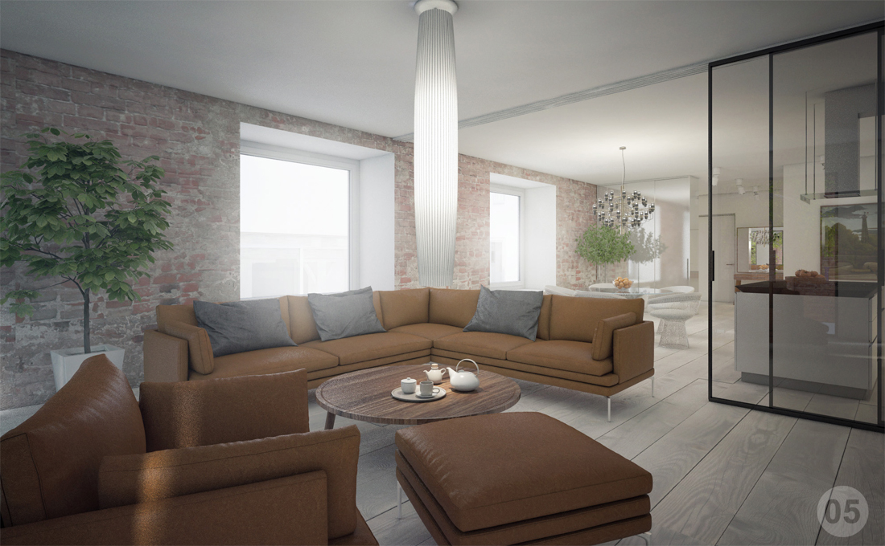
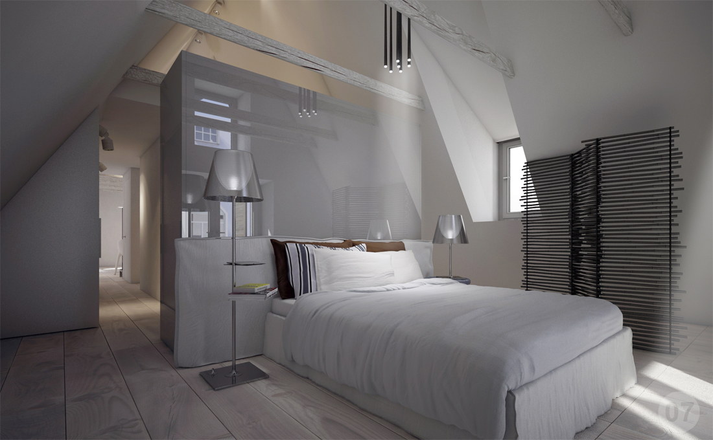
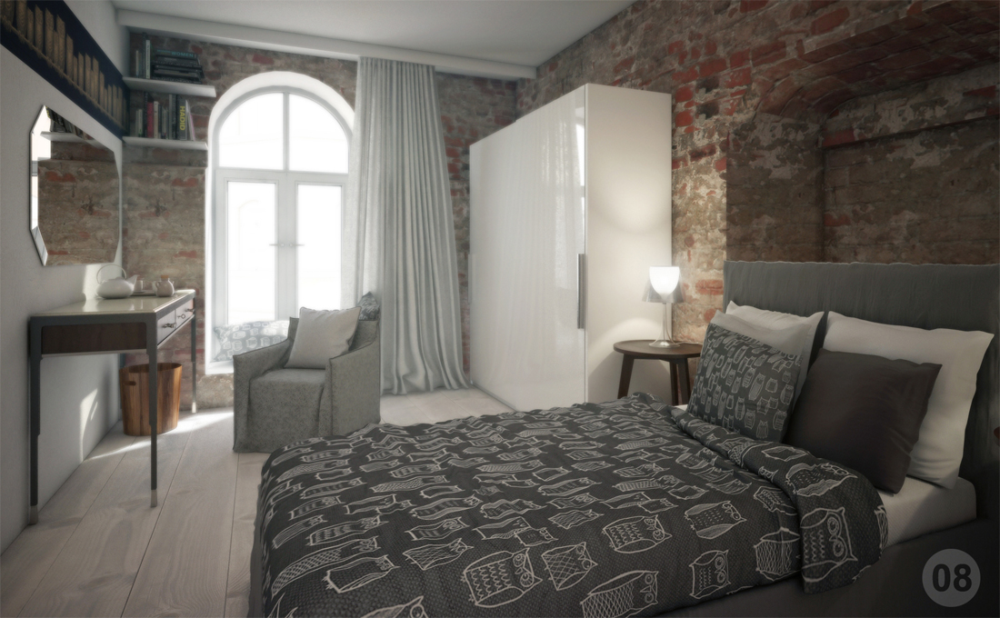
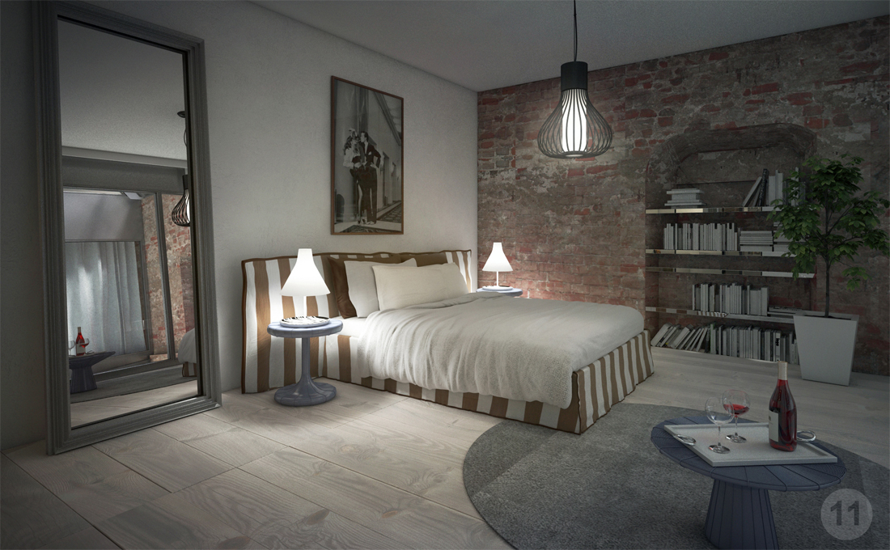
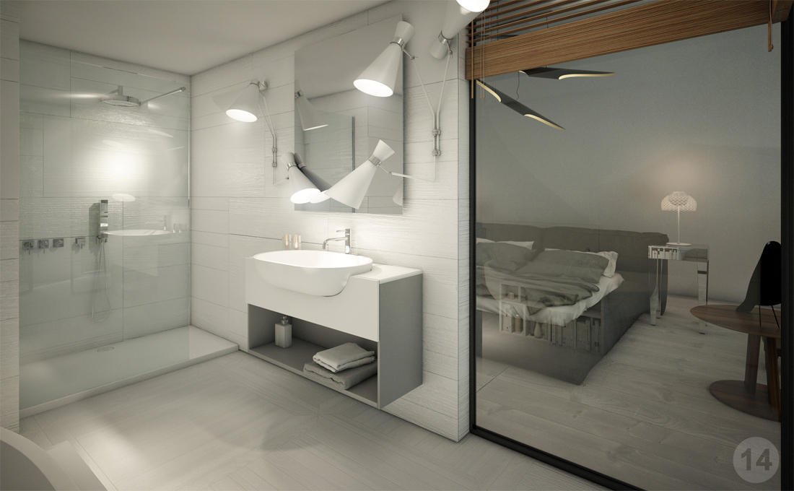
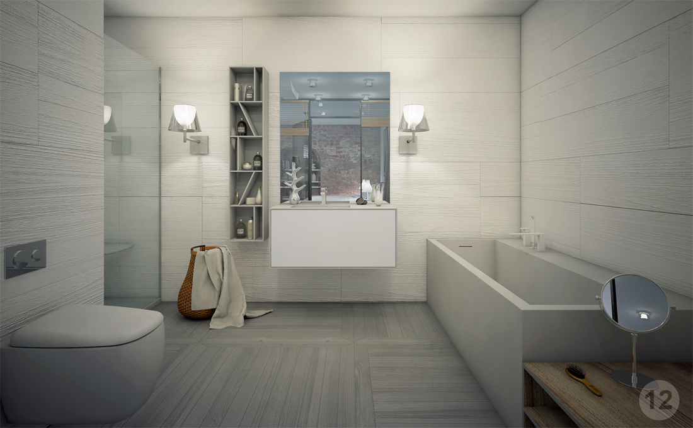

+++
weight = 6
date = "2014-07-11T10:54:24+02:00"
draft = false
title = "Miesnieku"
desc = "Interior renders for 3 building complex with 12 apartments, project consist with more than 100 renders"
location = "Rīga, Latvia"
architect = "Arhis Arhitekti"
designer = "Elizabete Ivanova"
cooparation = "Matīss Mailītis"
tags    = "Interior"
slug = "miesnieku"
thumbnail = "images/projects/miesnieku/350/1.jpg"
+++

