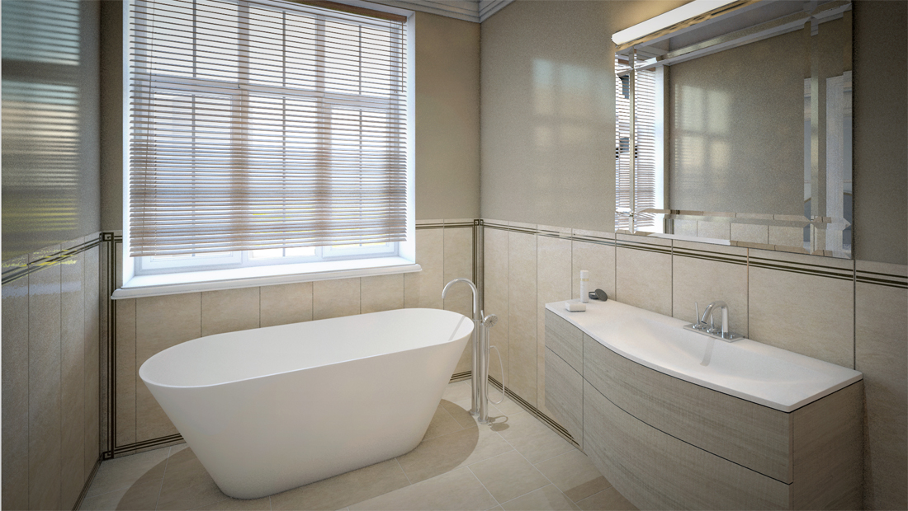

+++
weight = 2
date = "2014-07-11T10:54:24+02:00"
draft = false
title = "Skolas"
desc = "Design for an apartment building, renders for one floor to represent all building, more than 75 renders"
location = "Rīga, Latvia"
architect = "Architect"
designer = "Elizabete Ivanova"
cooparation = "n/a"
tags    = "Interior All"
slug = "skolas"
thumbnail = "images/projects/skolas/350/1.jpg"
+++

